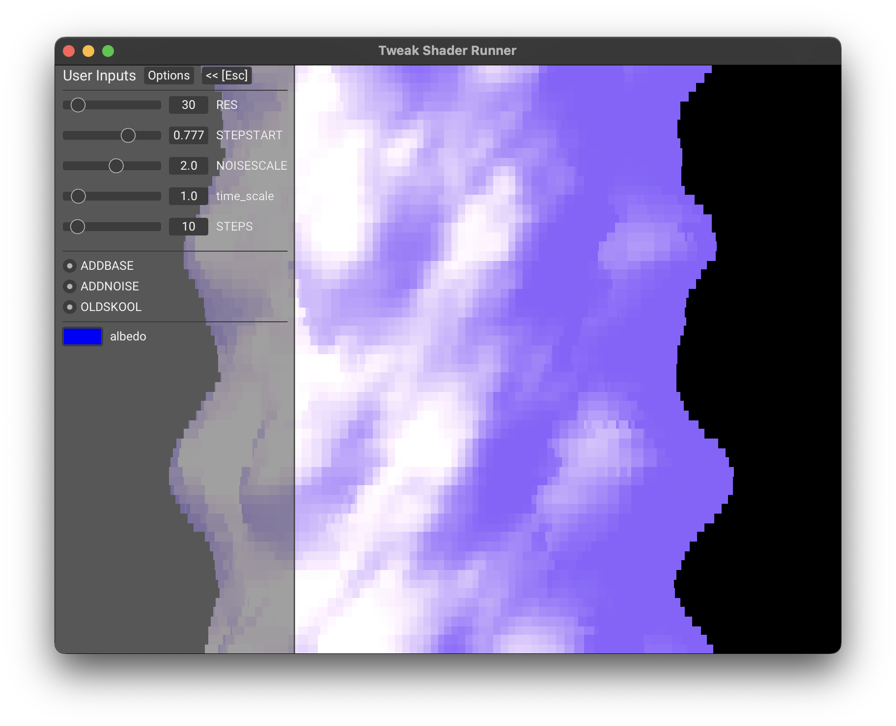

### Tweak Shader After Effects

This plugin allows you to run a shadertoy like glsl format in after effects. The glsl format is [documented here](https://github.com/mobile-bungalow/tweak_shader_ae_rs/tree/main/example_shaders).

The plugins supports multiple render passes, any number of layer inputs, up to 32 total inputs of any kind, and renders
at any bit depth. It builds for MacOs and Windows.

This plugin is in early development: prepare for bugs and crashes, pull requests and collaboration are welcome.

---
### Testing shaders outside of after effects
I have written [a utility](https://crates.io/crates/tweak_runner) outside of after effects to aid in writing shaders that are compatible with this plugin.

to install it you must have a working installation of rust. Then compile, install, and execute it with

```bash
cargo install tweak_runner
tweak_runner --file <shader file>
```

<div align="center">
    
</div>

---
### Building The Plugin
You will need [just](https://github.com/casey/just) installed, which can be done with `cargo install just`.

Download the after effects sdk for your desired platform and point to it with the `AESDK_ROOT` environment variable. You may also need an appropriate version of MSVC with Clang 16.0 + installed on windows, and development tools with a signing certificate set up on MacOs.

On MacOs and windows you can build with

```bash
just build
```

On MacOs you can build a release with

```Bash
just build release
```

The plugin should be in the release directory
